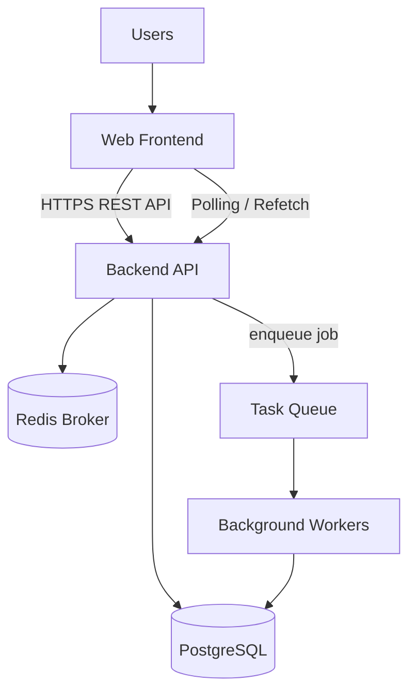
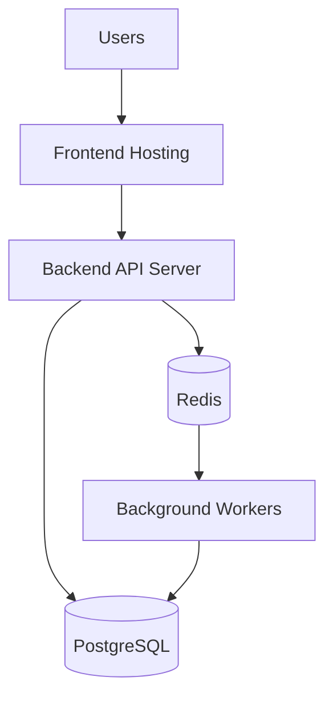

# Техническое задание: Lab Project Tracker with Pet Gamification

## 1. Метаданные

**Название продукта:** Lab Project Tracker with Pet Gamification  
**Версия ТЗ:** 2.0  
**Статус:** Draft  
**Дата:** 2026-05-30  
**Платформа MVP:** web application  
**Язык интерфейса MVP:** русский  
**Основной стек MVP:** FastAPI, PostgreSQL, Redis, Taskiq, web frontend  

## 2. Краткое описание

Продукт предназначен для лабораторий, исследовательских групп и команд разработки, где научная работа, разработка, публикации и личное планирование должны жить в одном рабочем пространстве.

Система должна позволять:

- вести лаборатории/workspaces;
- создавать проекты разных типов: исследование, разработка, публикация, эксперимент, административная работа;
- вести статьи как научные артефакты внутри проекта или workspace;
- создавать командные задачи по проектам, статьям и общим активностям;
- вести приватные личные задачи пользователя;
- обсуждать работу в комментариях;
- назначать ответственных;
- отслеживать дедлайны;
- получать уведомления;
- видеть командный прогресс;
- получать игровые награды через виртуального питомца.

Статьи являются важным сценарием, но не единственным центром системы. Главная сущность управления работой в MVP - задача, а задача может принадлежать проекту, статье, workspace или быть личной.

## 3. Продуктовая логика

```text
Laboratory / Workspace = команда или лаборатория
Project = рабочее направление, исследование, продуктовая инициатива или разработка
Article = научный артефакт внутри workspace или project
Task = универсальная единица работы
Personal Task = приватная личная задача пользователя
Domain Event = зафиксированное действие
Gamification = расчет награды
Pet = визуальное отображение личного прогресса
Activity Feed = командная видимость публичной активности
Notifications = личные уведомления
```

Ключевое архитектурное правило:

```text
Project / Article / Task = источник правды
Domain Event = факт изменения
Worker = обработка побочных эффектов
Reward = результат события
Pet = визуализация прогресса
Activity Feed = командная история
```

Frontend не должен напрямую начислять XP, создавать награды или менять игровые показатели питомца. Все игровые изменения должны происходить на backend через domain events и workers.

## 4. Анализ похожих продуктов и выводы

В продукте используются паттерны из нескольких классов систем:

| Продукт | Полезный паттерн | Как применить |
|---|---|---|
| Asana | Задача как базовый строительный блок, assignee, collaborators, comments, My Tasks | Сделать универсальную задачу центральной сущностью и отдельный агрегатор `My Tasks` |
| Trello | Boards/lists/cards, due dates, comments, checklist-style work | Дать простые доски проектов и статусы без перегруза enterprise-функциями |
| Notion | Projects/tasks рядом с документами и базами знаний | Статьи и проектные документы не должны конкурировать с задачами, а должны связываться с ними |
| Jira | Workflow по статусам для разных типов работ | Поддержать статусы задач, проектов и статей как отдельные workflow |
| ClickUp | Workspace/Space-style иерархия для разных команд и типов работ | Workspace должен вмещать и научную, и разработческую часть лаборатории |
| Todoist | Личный productivity tracking, цели, streak/karma-подход | Личные задачи должны быть полноценным приватным контуром |
| Habitica | Игровые награды за реальные задачи, групповые задачи и индивидуальные награды | Награда должна начисляться за факт выполненной работы, а не по команде frontend |

Выводы для MVP:

- задача должна быть универсальной, а не только задачей внутри статьи;
- статьи должны быть отдельным типом артефакта с научным workflow;
- проекты должны объединять разработку, исследования и публикации;
- личные задачи должны существовать отдельно от командных данных;
- приватность личных задач должна быть жесткой по умолчанию;
- игровые награды должны быть вторичным слоем, который реагирует на реальные действия;
- activity feed должен показывать только командные события;
- Team Room не должен раскрывать приватное содержание личной работы.

Источники анализа:

- Asana Help: https://help.asana.com/s/article/understanding-tasks
- Trello Guide: https://trello.com/en-US/guide/trello-101
- Trello Support: https://support.atlassian.com/trello/docs/using-trello
- Notion Help: https://www.notion.com/help/sprints
- Jira Workflows: https://www.atlassian.com/software/jira/guides/workflows/overview
- ClickUp Spaces: https://clickup.com/spaces
- Todoist Karma: https://www.todoist.com/karma
- Habitica FAQ: https://habitica.com/static/faq

## 5. Пользователи и роли

### 5.1 Типы пользователей

| Тип | Описание |
|---|---|
| Владелец лаборатории | Создает workspace, управляет участниками и настройками |
| Администратор | Управляет участниками, проектами, статьями и задачами |
| Руководитель проекта | Управляет конкретными проектами и проектными задачами |
| Научный редактор | Ведет статьи, ревью, дедлайны и publication workflow |
| Разработчик | Работает над инженерными задачами, релизами, багами и инфраструктурой |
| Исследователь | Работает над экспериментами, статьями, данными и ревью |
| Наблюдатель | Смотрит разрешенные командные данные без редактирования |
| Личный пользователь | Ведет приватные задачи и прогресс питомца |

### 5.2 Workspace roles

```text
OWNER
ADMIN
PROJECT_LEAD
EDITOR
MEMBER
VIEWER
```

### 5.3 Project roles

```text
PROJECT_OWNER
LEAD
CONTRIBUTOR
REVIEWER
OBSERVER
```

### 5.4 Article roles

```text
AUTHOR
CO_AUTHOR
REVIEWER
EDITOR
OBSERVER
```

## 6. Границы MVP

### 6.1 Входит в MVP

MVP должен включать:

- регистрацию и логин;
- refresh/logout;
- профиль пользователя;
- создание workspace/laboratory;
- управление участниками workspace;
- роли workspace;
- создание и ведение проектов;
- статусы проектов;
- проектные участники;
- универсальные задачи;
- задачи workspace;
- задачи проекта;
- задачи статьи;
- приватные личные задачи;
- назначение командных задач;
- закрытие и переоткрытие задач;
- статьи как научные артефакты;
- publication workflow статьи;
- комментарии к проектам, статьям и задачам;
- mentions в командных комментариях;
- личного питомца пользователя;
- XP и уровни питомца;
- начисление наград через workers;
- activity feed только для командных событий;
- Team Room;
- простые уведомления;
- polling/refetch вместо realtime;
- PostgreSQL;
- Redis queue;
- background worker.

### 6.2 Не входит в MVP

В MVP не реализуются:

- WebSocket;
- SSE;
- полноценный чат;
- мобильное приложение;
- AI-помощник;
- платежи;
- магазин предметов;
- сложная экономика питомцев;
- GitHub/Jira/Linear integrations;
- Google Docs / Overleaf integration;
- team pet;
- публичное sharing личных задач;
- календарная синхронизация;
- сложная аналитика;
- импорт/экспорт документов;
- кастомные workflow builders;
- granular permissions на уровне отдельных полей.

## 7. Основные сущности

### 7.1 Workspace / Laboratory

Workspace - верхний командный контейнер. В интерфейсе MVP рекомендуется использовать термин "Лаборатория", если продукт позиционируется для научно-разработческих команд.

Workspace содержит:

- участников;
- проекты;
- статьи;
- командные задачи;
- activity feed;
- Team Room;
- workspace notifications.

### 7.2 Project

Project - рабочее направление внутри workspace.

Проект может быть:

```text
RESEARCH
SOFTWARE
PUBLICATION
EXPERIMENT
ADMIN
OTHER
```

Проект может содержать:

- задачи разработки;
- задачи исследования;
- задачи экспериментов;
- статьи;
- комментарии;
- участников;
- публичную историю событий.

### 7.3 Article

Article - научный артефакт. Он может существовать:

- внутри workspace без проекта;
- внутри конкретного проекта.

Article имеет собственный publication workflow:

```text
IDEA
PLANNING
WRITING
INTERNAL_REVIEW
REVISION
SUBMITTED
UNDER_REVIEW
ACCEPTED
PUBLISHED
ARCHIVED
```

### 7.4 Task

Task - универсальная единица работы.

Task scope:

```text
WORKSPACE
PROJECT
ARTICLE
PERSONAL
```

Task visibility:

```text
PRIVATE
WORKSPACE
PROJECT
ARTICLE
```

Task types:

```text
RESEARCH
WRITING
REVIEW
FORMATTING
DEVELOPMENT
DESIGN
TESTING
DEPLOYMENT
EXPERIMENT
SUBMISSION
RESPONSE_TO_REVIEWER
ADMIN
PERSONAL
OTHER
```

Task statuses:

```text
TODO
IN_PROGRESS
IN_REVIEW
DONE
CANCELLED
```

### 7.5 Personal Task

Personal Task - приватная задача пользователя.

Правила:

- видна только владельцу;
- не отображается в workspace task list;
- не отображается в project board;
- не отображается в article detail;
- не попадает в Team Room;
- не раскрывается в activity feed;
- может начислять XP питомцу владельца;
- reward metadata не должен содержать title или description личной задачи.

### 7.6 Pet

Pet - виртуальный питомец пользователя.

В MVP:

```text
1 user = 1 pet
```

Pet отображает:

- XP;
- level;
- mood;
- hunger;
- energy;
- простые реакции на прогресс.

## 8. Функциональные требования

### 8.1 Auth and users

**FR-AUTH-1:** Система MUST позволять пользователю зарегистрироваться по email и паролю.  
**FR-AUTH-2:** Система MUST позволять пользователю войти по email и паролю.  
**FR-AUTH-3:** Система MUST хранить пароль только в виде password hash.  
**FR-AUTH-4:** Система MUST брать `user_id` из auth token, а не из body запроса.  
**FR-AUTH-5:** Система MUST поддерживать logout и refresh.  
**FR-USER-1:** Пользователь MUST иметь профиль с `display_name` и опциональным `avatar_url`.  
**FR-USER-2:** Пользователь MUST иметь одного питомца.  
**FR-USER-3:** Пользователь MUST иметь доступ к личным задачам независимо от workspace membership.  

### 8.2 Workspaces

**FR-WS-1:** Пользователь MUST иметь возможность создать workspace/laboratory.  
**FR-WS-2:** Создатель workspace MUST получать роль `OWNER`.  
**FR-WS-3:** `OWNER` и `ADMIN` MUST иметь возможность добавлять участников.  
**FR-WS-4:** Пользователь MUST видеть только workspace, где он является участником.  
**FR-WS-5:** `VIEWER` MUST NOT создавать или редактировать проекты, статьи, командные задачи и командные комментарии.  

### 8.3 Projects

**FR-PROJ-1:** Участник с правами MUST иметь возможность создать проект внутри workspace.  
**FR-PROJ-2:** Проект MUST принадлежать одному workspace.  
**FR-PROJ-3:** Проект MUST иметь тип и статус.  
**FR-PROJ-4:** Проект MAY содержать статьи.  
**FR-PROJ-5:** Проект MAY содержать задачи без привязки к статье.  
**FR-PROJ-6:** Изменение статуса проекта SHOULD создавать domain event `PROJECT_STATUS_CHANGED`.  
**FR-PROJ-7:** Пользователь MUST NOT видеть проект из workspace, где он не является участником.  

Project statuses:

```text
IDEA
PLANNING
ACTIVE
PAUSED
IN_REVIEW
DONE
ARCHIVED
```

### 8.4 Articles

**FR-ART-1:** Статья MUST принадлежать workspace.  
**FR-ART-2:** Статья MAY принадлежать project.  
**FR-ART-3:** Статья MUST иметь publication status.  
**FR-ART-4:** Изменение статуса статьи MUST создавать domain event `ARTICLE_STATUS_CHANGED`.  
**FR-ART-5:** Пользователь MUST NOT видеть статью из чужого workspace.  
**FR-ART-6:** Статья MAY иметь `target_journal`, `document_url`, `deadline` и участников.  
**FR-ART-7:** Статья MAY иметь задачи.  

### 8.5 Universal tasks

**FR-TASK-1:** Задача MUST иметь `scope`.  
**FR-TASK-2:** Задача MUST иметь `visibility`.  
**FR-TASK-3:** Задача с `scope = PROJECT` MUST иметь `project_id`.  
**FR-TASK-4:** Задача с `scope = ARTICLE` MUST иметь `article_id`.  
**FR-TASK-5:** Задача с `scope = PERSONAL` MUST иметь `owner_id` и `visibility = PRIVATE`.  
**FR-TASK-6:** Задача с `scope = PERSONAL` MUST NOT требовать `workspace_id`.  
**FR-TASK-7:** Командная задача MAY иметь `assignee_id` из участников workspace.  
**FR-TASK-8:** Закрытие задачи MUST устанавливать `status = DONE` и `completed_at`.  
**FR-TASK-9:** Закрытие задачи MUST создавать domain event `TASK_COMPLETED`.  
**FR-TASK-10:** Переоткрытие задачи MUST создавать domain event `TASK_REOPENED`.  
**FR-TASK-11:** `MEMBER` MUST иметь возможность закрыть собственную командную задачу.  
**FR-TASK-12:** `MEMBER` MUST NOT закрывать чужую командную задачу без роли `OWNER`, `ADMIN`, `PROJECT_LEAD` или `EDITOR`.  

### 8.6 Personal tasks

**FR-PT-1:** Пользователь MUST иметь возможность создать личную задачу.  
**FR-PT-2:** Личная задача MUST быть видна только владельцу.  
**FR-PT-3:** Личная задача MUST NOT отображаться в workspace task list.  
**FR-PT-4:** Личная задача MUST NOT отображаться в project board.  
**FR-PT-5:** Личная задача MUST NOT отображаться в article detail.  
**FR-PT-6:** Личная задача MUST NOT создавать workspace activity event.  
**FR-PT-7:** Личная задача MAY начислять XP питомцу владельца.  
**FR-PT-8:** Личные задачи MUST отображаться в разделе `My Tasks` и `Personal Tasks`.  
**FR-PT-9:** Mentions в личных задачах MUST NOT отправлять уведомления другим пользователям в MVP.  

### 8.7 Comments

**FR-COM-1:** Пользователь с правами MUST иметь возможность комментировать проект.  
**FR-COM-2:** Пользователь с правами MUST иметь возможность комментировать статью.  
**FR-COM-3:** Пользователь с правами MUST иметь возможность комментировать командную задачу.  
**FR-COM-4:** Пользователь MUST иметь возможность комментировать собственную личную задачу.  
**FR-COM-5:** Mentions MUST работать только в командном контексте workspace/project/article/task.  
**FR-COM-6:** Командный комментарий с mention MUST создавать notification для упомянутого участника workspace.  
**FR-COM-7:** Автор комментария MUST иметь возможность редактировать и удалять свой комментарий.  

### 8.8 Pets and rewards

**FR-PET-1:** Pet MUST создаваться для пользователя автоматически после регистрации или при первом входе.  
**FR-PET-2:** Pet MUST иметь `name`, `species`, `level`, `xp`, `mood`, `hunger`, `energy`.  
**FR-PET-3:** Пользователь MAY менять имя питомца.  
**FR-PET-4:** Пользователь MUST NOT напрямую менять XP, level, mood, hunger или energy.  
**FR-GAME-1:** XP MUST начисляться только через worker на основании domain events.  
**FR-GAME-2:** Закрытие командной задачи MUST начислять базовую награду.  
**FR-GAME-3:** Закрытие личной задачи SHOULD начислять меньшую награду, чем командная задача.  
**FR-GAME-4:** Закрытие задачи до дедлайна SHOULD начислять bonus XP.  
**FR-GAME-5:** Перевод статьи в ключевые publication statuses SHOULD начислять повышенную награду.  
**FR-GAME-6:** Перевод проекта в `DONE` SHOULD начислять повышенную награду участникам проекта.  
**FR-GAME-7:** Повторная обработка одного domain event MUST NOT создавать дублирующие rewards.  

### 8.9 Activity feed

**FR-ACT-1:** Командные значимые действия MUST создавать activity event.  
**FR-ACT-2:** Activity feed MUST отображать события только внутри текущего workspace.  
**FR-ACT-3:** Activity feed MUST NOT раскрывать личные задачи.  
**FR-ACT-4:** Activity feed SHOULD поддерживать cursor pagination.  

### 8.10 Notifications

**FR-NOTIF-1:** Система MUST создавать уведомление при назначении пользователя на командную задачу.  
**FR-NOTIF-2:** Система MUST создавать уведомление при mention пользователя в командном комментарии.  
**FR-NOTIF-3:** Система SHOULD создавать личное уведомление при приближении дедлайна личной задачи.  
**FR-NOTIF-4:** Пользователь MUST видеть только собственные уведомления.  
**FR-NOTIF-5:** Пользователь MUST иметь возможность отметить уведомление прочитанным.  

### 8.11 Domain events

**FR-EVT-1:** Все важные рабочие действия MUST фиксироваться как domain events.  
**FR-EVT-2:** Domain event MUST иметь статус обработки.  
**FR-EVT-3:** Worker MUST обрабатывать pending events асинхронно.  
**FR-EVT-4:** Worker MUST быть идемпотентным для rewards, notifications и activity events.  
**FR-EVT-5:** Domain events личных задач MUST иметь `privacy_level = PRIVATE`.  
**FR-EVT-6:** Payload приватного event MUST NOT содержать title или description личной задачи, если event может попасть в общие логи или analytics.  

## 9. Нефункциональные требования

**NFR-1 Performance:** 95% read-запросов SHOULD отвечать менее чем за 500 мс при 100 одновременных пользователях MVP.  
**NFR-2 Performance:** 95% mutation-запросов SHOULD отвечать менее чем за 800 мс без ожидания полной обработки gamification.  
**NFR-3 Reliability:** Закрытие задачи MUST быть атомарным относительно обновления задачи и создания domain event.  
**NFR-4 Security:** Все командные endpoints MUST проверять auth и workspace membership.  
**NFR-5 Privacy:** Personal tasks MUST be private by default and MUST NOT leak through API, activity feed, team room, notifications or reward metadata.  
**NFR-6 Security:** Frontend MUST NOT иметь API для прямого создания rewards или изменения XP.  
**NFR-7 Scalability:** Архитектура MUST позволять разделить очереди workers по типам событий без переписывания доменной модели.  
**NFR-8 Observability:** Backend SHOULD логировать request id, user id, event id и ошибку worker.  
**NFR-9 Accessibility:** Основные страницы SHOULD соответствовать WCAG 2.1 AA по клавиатурной навигации и контрасту.  
**NFR-10 Data integrity:** Основные связи MUST быть защищены foreign keys и constraints.  

## 10. Архитектура MVP

### 10.1 Рекомендуемый стек

```text
Frontend: Web application
Backend: FastAPI modular monolith
Database: PostgreSQL
Broker: Redis
Workers: Taskiq
Realtime: отсутствует в MVP
Transport: HTTPS REST API
```

### 10.2 High-level architecture



### 10.3 Backend modules

```text
Backend API
├── Auth Module
├── Users Module
├── Workspaces Module
├── Projects Module
├── Articles Module
├── Tasks Module
├── Personal Tasks Module
├── Comments Module
├── Pets Module
├── Gamification Module
├── Rewards Module
├── Activity Feed Module
├── Notifications Module
├── Domain Events Module
└── Jobs Module
```

## 11. Data model

### 11.1 users

| Field | Type | Constraints |
|---|---|---|
| id | uuid | pk |
| email | varchar | unique, not null |
| password_hash | varchar | not null |
| display_name | varchar | not null |
| avatar_url | text | nullable |
| created_at | timestamptz | not null |
| updated_at | timestamptz | not null |

### 11.2 workspaces

| Field | Type | Constraints |
|---|---|---|
| id | uuid | pk |
| name | varchar | not null |
| description | text | nullable |
| owner_id | uuid | fk users.id |
| created_at | timestamptz | not null |
| updated_at | timestamptz | not null |

### 11.3 workspace_members

| Field | Type | Constraints |
|---|---|---|
| id | uuid | pk |
| workspace_id | uuid | fk workspaces.id |
| user_id | uuid | fk users.id |
| role | enum | OWNER, ADMIN, PROJECT_LEAD, EDITOR, MEMBER, VIEWER |
| joined_at | timestamptz | not null |

Unique:

```text
(workspace_id, user_id)
```

### 11.4 projects

| Field | Type | Constraints |
|---|---|---|
| id | uuid | pk |
| workspace_id | uuid | fk workspaces.id |
| name | varchar | not null |
| description | text | nullable |
| type | enum | RESEARCH, SOFTWARE, PUBLICATION, EXPERIMENT, ADMIN, OTHER |
| status | enum | IDEA, PLANNING, ACTIVE, PAUSED, IN_REVIEW, DONE, ARCHIVED |
| owner_id | uuid | fk users.id |
| deadline | date | nullable |
| created_at | timestamptz | not null |
| updated_at | timestamptz | not null |

### 11.5 project_members

| Field | Type | Constraints |
|---|---|---|
| id | uuid | pk |
| project_id | uuid | fk projects.id |
| user_id | uuid | fk users.id |
| role | enum | PROJECT_OWNER, LEAD, CONTRIBUTOR, REVIEWER, OBSERVER |

Unique:

```text
(project_id, user_id)
```

### 11.6 articles

| Field | Type | Constraints |
|---|---|---|
| id | uuid | pk |
| workspace_id | uuid | fk workspaces.id |
| project_id | uuid | fk projects.id, nullable |
| title | varchar | not null |
| description | text | nullable |
| status | enum | not null |
| owner_id | uuid | fk users.id |
| target_journal | varchar | nullable |
| document_url | text | nullable |
| deadline | date | nullable |
| created_at | timestamptz | not null |
| updated_at | timestamptz | not null |

### 11.7 article_members

| Field | Type | Constraints |
|---|---|---|
| id | uuid | pk |
| article_id | uuid | fk articles.id |
| user_id | uuid | fk users.id |
| role | enum | AUTHOR, CO_AUTHOR, REVIEWER, EDITOR, OBSERVER |

Unique:

```text
(article_id, user_id)
```

### 11.8 tasks

| Field | Type | Constraints |
|---|---|---|
| id | uuid | pk |
| workspace_id | uuid | fk workspaces.id, nullable for personal-only task |
| project_id | uuid | fk projects.id, nullable |
| article_id | uuid | fk articles.id, nullable |
| owner_id | uuid | fk users.id |
| title | varchar | not null |
| description | text | nullable |
| scope | enum | WORKSPACE, PROJECT, ARTICLE, PERSONAL |
| visibility | enum | PRIVATE, WORKSPACE, PROJECT, ARTICLE |
| status | enum | TODO, IN_PROGRESS, IN_REVIEW, DONE, CANCELLED |
| type | enum | not null |
| priority | enum | LOW, MEDIUM, HIGH, URGENT |
| assignee_id | uuid | fk users.id, nullable |
| created_by | uuid | fk users.id |
| due_date | date | nullable |
| completed_at | timestamptz | nullable |
| created_at | timestamptz | not null |
| updated_at | timestamptz | not null |

Required constraints:

```text
scope = PERSONAL -> owner_id is not null and visibility = PRIVATE
scope = PROJECT -> project_id is not null and workspace_id is not null
scope = ARTICLE -> article_id is not null and workspace_id is not null
visibility = PRIVATE -> visible only to owner_id
assignee_id for team task -> user must be workspace member
```

### 11.9 comments

| Field | Type | Constraints |
|---|---|---|
| id | uuid | pk |
| workspace_id | uuid | fk workspaces.id, nullable for personal-only task |
| project_id | uuid | fk projects.id, nullable |
| article_id | uuid | fk articles.id, nullable |
| task_id | uuid | fk tasks.id, nullable |
| author_id | uuid | fk users.id |
| text | text | not null |
| visibility | enum | PRIVATE, WORKSPACE, PROJECT, ARTICLE |
| created_at | timestamptz | not null |
| updated_at | timestamptz | not null |
| deleted_at | timestamptz | nullable |

### 11.10 pets

| Field | Type | Constraints |
|---|---|---|
| id | uuid | pk |
| user_id | uuid | fk users.id, unique |
| name | varchar | not null |
| species | varchar | not null |
| level | int | not null, default 1 |
| xp | int | not null, default 0 |
| mood | int | not null, 0..100 |
| hunger | int | not null, 0..100 |
| energy | int | not null, 0..100 |
| created_at | timestamptz | not null |
| updated_at | timestamptz | not null |

### 11.11 rewards

| Field | Type | Constraints |
|---|---|---|
| id | uuid | pk |
| user_id | uuid | fk users.id |
| workspace_id | uuid | fk workspaces.id, nullable |
| source_event_id | uuid | fk domain_events.id |
| xp_amount | int | not null |
| reward_type | enum | XP, FOOD, MOOD, ENERGY, ITEM |
| privacy_level | enum | PRIVATE, WORKSPACE |
| item_id | uuid | nullable |
| created_at | timestamptz | not null |

Unique:

```text
(source_event_id, user_id, reward_type)
```

### 11.12 activity_events

| Field | Type | Constraints |
|---|---|---|
| id | uuid | pk |
| workspace_id | uuid | fk workspaces.id |
| actor_id | uuid | fk users.id |
| event_type | enum | not null |
| entity_type | enum | not null |
| entity_id | uuid | not null |
| text | text | not null |
| metadata | jsonb | not null, default {} |
| visibility | enum | WORKSPACE, PROJECT, ARTICLE |
| created_at | timestamptz | not null |

Personal tasks MUST NOT create `activity_events` in MVP.

### 11.13 notifications

| Field | Type | Constraints |
|---|---|---|
| id | uuid | pk |
| user_id | uuid | fk users.id |
| workspace_id | uuid | fk workspaces.id, nullable |
| type | enum | not null |
| title | varchar | not null |
| body | text | nullable |
| entity_type | enum | nullable |
| entity_id | uuid | nullable |
| is_read | boolean | not null, default false |
| created_at | timestamptz | not null |

### 11.14 domain_events

| Field | Type | Constraints |
|---|---|---|
| id | uuid | pk |
| event_type | enum | not null |
| workspace_id | uuid | fk workspaces.id, nullable |
| actor_id | uuid | fk users.id |
| entity_type | enum | not null |
| entity_id | uuid | not null |
| privacy_level | enum | PRIVATE, WORKSPACE |
| payload | jsonb | not null |
| status | enum | PENDING, PROCESSING, PROCESSED, FAILED |
| error_message | text | nullable |
| created_at | timestamptz | not null |
| processed_at | timestamptz | nullable |

## 12. REST API

### 12.1 Error format

```ts
type ApiError = {
  error: {
    code: string;
    message: string;
    details?: Record<string, unknown>;
  };
};
```

### 12.2 Auth and user

```text
POST /auth/register
POST /auth/login
POST /auth/logout
POST /auth/refresh
GET /me
PATCH /me
```

### 12.3 Workspaces

```text
POST /workspaces
GET /workspaces
GET /workspaces/:id
PATCH /workspaces/:id
GET /workspaces/:id/members
POST /workspaces/:id/invite
PATCH /workspaces/:id/members/:userId
DELETE /workspaces/:id/members/:userId
```

### 12.4 Projects

```text
POST /workspaces/:workspaceId/projects
GET /workspaces/:workspaceId/projects
GET /projects/:id
PATCH /projects/:id
PATCH /projects/:id/status
DELETE /projects/:id
POST /projects/:id/members
DELETE /projects/:id/members/:userId
GET /projects/:id/tasks
GET /projects/:id/articles
```

### 12.5 Articles

```text
POST /workspaces/:workspaceId/articles
POST /projects/:projectId/articles
GET /workspaces/:workspaceId/articles
GET /projects/:projectId/articles
GET /articles/:id
PATCH /articles/:id
DELETE /articles/:id
PATCH /articles/:id/status
POST /articles/:id/members
DELETE /articles/:id/members/:userId
GET /articles/:id/tasks
```

### 12.6 Tasks

```text
POST /tasks
GET /tasks/:id
PATCH /tasks/:id
DELETE /tasks/:id
PATCH /tasks/:id/complete
PATCH /tasks/:id/reopen

GET /workspaces/:workspaceId/tasks
GET /projects/:projectId/tasks
GET /articles/:articleId/tasks
GET /me/tasks
GET /me/tasks/personal
```

```ts
type CreateTaskRequest = {
  scope: "WORKSPACE" | "PROJECT" | "ARTICLE" | "PERSONAL";
  workspace_id?: string;
  project_id?: string;
  article_id?: string;
  title: string;
  description?: string;
  type: TaskType;
  priority?: "LOW" | "MEDIUM" | "HIGH" | "URGENT";
  assignee_id?: string;
  due_date?: string;
};
```

For `scope = PERSONAL`, backend MUST set:

```text
owner_id = current_user.id
assignee_id = current_user.id
visibility = PRIVATE
```

### 12.7 Comments

```text
POST /projects/:projectId/comments
GET /projects/:projectId/comments
POST /articles/:articleId/comments
GET /articles/:articleId/comments
POST /tasks/:taskId/comments
GET /tasks/:taskId/comments
PATCH /comments/:id
DELETE /comments/:id
```

### 12.8 Pets

```text
GET /pets/me
PATCH /pets/me
GET /workspaces/:workspaceId/pets
```

`PATCH /pets/me` MAY update only:

```text
name
```

### 12.9 Activity and notifications

```text
GET /workspaces/:workspaceId/activity?cursor=&limit=
GET /workspaces/:workspaceId/team-room
GET /notifications
PATCH /notifications/:id/read
PATCH /notifications/read-all
```

## 13. Access control

Базовые правила:

```text
Командные данные видят только участники workspace.
Проектные данные видят участники workspace с доступом к проекту.
Личные задачи видит только owner_id.
Activity feed не раскрывает personal tasks.
Team Room не раскрывает personal tasks.
Rewards от personal tasks имеют privacy_level = PRIVATE.
```

Матрица прав:

| Action | Owner | Admin | Project Lead | Editor | Member | Viewer |
|---|---:|---:|---:|---:|---:|---:|
| Create project | + | + | + | + | + | - |
| Edit project | + | + | +/- | - | - | - |
| Archive project | + | + | +/- | - | - | - |
| Create article | + | + | + | + | + | - |
| Edit article | + | + | + | + | +/- | - |
| Create team task | + | + | + | + | + | - |
| Complete own team task | + | + | + | + | + | - |
| Complete others team task | + | + | + | + | - | - |
| Create personal task | + | + | + | + | + | + |
| View own personal tasks | + | + | + | + | + | + |
| View others personal tasks | - | - | - | - | - | - |
| Comment in team context | + | + | + | + | + | - |
| View team room | + | + | + | + | + | + |
| Manage members | + | + | - | - | - | - |
| Manage rewards directly | - | - | - | - | - | - |

## 14. Gamification rules

### 14.1 MVP reward table

| Event | Reward |
|---|---:|
| Team task completed | +10 XP |
| Personal task completed | +5 XP |
| Task completed before due date | +5 XP |
| Project moved to DONE | +50 XP |
| Article moved to SUBMITTED | +50 XP |
| Article moved to ACCEPTED | +100 XP |
| Article moved to PUBLISHED | +150 XP |
| Team comment added | +1 XP, max 5/day |

### 14.2 Anti-abuse rules

**AR-1:** Повторное закрытие уже закрытой задачи MUST NOT создавать новую награду.  
**AR-2:** Повторная обработка event MUST NOT создавать новую награду.  
**AR-3:** Personal task rewards SHOULD быть ниже team task rewards.  
**AR-4:** Comment XP MUST иметь дневной лимит.  
**AR-5:** Frontend MUST NOT отправлять `xp_amount`.  
**AR-6:** Reward source MUST always be a domain event.  

### 14.3 Pet level formula MVP

Для MVP допустима простая формула:

```text
level = floor(total_xp / 100) + 1
```

В будущем формулу можно заменить таблицей уровней.

## 15. Main flows

### 15.1 Team task completed

```text
User closes project/article/workspace task
↓
API checks auth, membership and permissions
↓
Task status becomes DONE
↓
TASK_COMPLETED domain event is created with privacy_level = WORKSPACE
↓
Worker calculates reward
↓
Worker updates pet
↓
Worker creates workspace activity event
↓
Worker creates notifications if needed
```

### 15.2 Personal task completed

```text
User closes personal task
↓
API checks owner_id = current_user.id
↓
Task status becomes DONE
↓
TASK_COMPLETED domain event is created with privacy_level = PRIVATE
↓
Worker calculates personal reward
↓
Worker updates pet
↓
No workspace activity event is created
↓
Only owner-visible notification may be created
```

### 15.3 Article status changed

```text
User changes article status
↓
API checks workspace membership and role
↓
Article status is updated
↓
ARTICLE_STATUS_CHANGED event is created
↓
Worker grants reward if status is rewarded
↓
Worker updates pet
↓
Worker creates activity event
```

### 15.4 Project with science and development

```text
Project "Research Portal" is created
↓
Team adds software tasks: API, frontend, tests, deployment
↓
Team adds article "Methodology paper"
↓
Article has publication workflow
↓
Project tasks and article tasks both create rewards
↓
Team Room shows public project progress
```

## 16. Frontend requirements

### 16.1 Pages

```text
Auth Page
Dashboard
Laboratory / Workspace Page
Projects Board
Project Detail Page
Articles Board
Article Detail Page
My Tasks
Personal Tasks
Task Detail
Comments
Pet Page
Team Room
Notifications
Profile / Settings
```

### 16.2 Dashboard

Dashboard MUST показывать:

- мои командные задачи;
- мои личные задачи;
- ближайшие дедлайны;
- активные проекты;
- статьи в работе;
- прогресс питомца;
- последние командные события.

### 16.3 Projects Board

Projects Board MUST отображать проекты по статусам:

```text
Idea -> Planning -> Active -> In Review -> Done -> Archived
```

### 16.4 My Tasks

My Tasks MUST показывать:

- assigned team tasks;
- personal tasks;
- фильтр по scope;
- фильтр по deadline;
- фильтр по status;
- быстрый complete/reopen.

Личные задачи MUST визуально отделяться от командных и иметь маркер приватности.

### 16.5 Project Detail Page

Project Detail Page MUST показывать:

- название;
- описание;
- тип проекта;
- статус;
- участников;
- дедлайн;
- проектные задачи;
- связанные статьи;
- комментарии;
- историю публичных событий проекта.

### 16.6 Article Detail Page

Article Detail Page MUST показывать:

- название;
- описание;
- publication status;
- связанный проект, если есть;
- участников;
- дедлайн;
- target journal;
- document URL;
- задачи статьи;
- комментарии;
- историю событий статьи.

### 16.7 Team Room

Team Room MUST показывать:

- питомцев участников workspace;
- публичный activity feed;
- последние командные награды;
- прогресс проектов;
- прогресс статей.

Team Room MUST NOT показывать:

- названия личных задач;
- описания личных задач;
- комментарии к личным задачам;
- дедлайны личных задач;
- private reward metadata.

## 17. Polling strategy

После mutation frontend MUST refetch только затронутые данные:

```text
PATCH /tasks/:id/complete
↓
GET /me/tasks
GET /pets/me
GET /notifications

If task.visibility != PRIVATE:
GET /workspaces/:id/activity
GET /projects/:id/tasks or GET /articles/:id/tasks
```

Периодический polling:

| Data | Frequency |
|---|---:|
| Notifications | 30 секунд |
| Activity feed | 30-60 секунд |
| Team Room | при открытии страницы и manual refresh |
| Pet | после reward-related mutations и при открытии Pet Page |
| My Tasks | после mutations и manual refresh |

## 18. Jobs and workers

Основные jobs:

```text
process_domain_event(event_id)
process_task_completed(event_id)
process_project_status_changed(event_id)
process_article_status_changed(event_id)
grant_reward(event_id)
update_pet_after_reward(reward_id)
create_activity_event(event_id)
create_notifications(event_id)
check_deadlines()
check_overdue_tasks()
calculate_streaks()
```

Для MVP используется одна очередь:

```text
default
```

Позже можно разделить:

```text
gamification
notifications
deadlines
activity
```

## 19. Edge cases

**EC-1:** Если задача уже `DONE`, повторный `PATCH /tasks/:id/complete` MUST NOT повторно начислять XP.  
**EC-2:** Если worker повторно обработал тот же event, rewards MUST NOT дублироваться.  
**EC-3:** Если пользователь удален из workspace, его командные открытые задачи SHOULD стать unassigned или требовать переназначения.  
**EC-4:** Если личная задача связана с workspace context, удаление пользователя из workspace MUST NOT удалять личную задачу.  
**EC-5:** Если комментарий содержит mention несуществующего пользователя, notification MUST NOT создаваться.  
**EC-6:** Если mention написан в личной задаче, notification другому пользователю MUST NOT создаваться.  
**EC-7:** Если Redis недоступен после successful mutation, domain event MUST остаться в `PENDING`.  
**EC-8:** Если worker упал во время обработки, event MUST перейти в `FAILED` или остаться retryable без потери данных.  
**EC-9:** Если deadline прошел, задача остается доступной для закрытия, но deadline bonus не начисляется.  
**EC-10:** Если пользователь запрашивает чужую personal task по id, API MUST вернуть 404 или 403 без раскрытия данных.  
**EC-11:** Если personal task reward создан, его metadata MUST NOT содержать task title или description.  
**EC-12:** Если проект архивирован, новые задачи в нем SHOULD быть запрещены или требовать unarchive.  
**EC-13:** Если статья связана с проектом, workspace_id статьи MUST совпадать с workspace_id проекта.  
**EC-14:** Если задача связана со статьей, workspace_id задачи MUST совпадать с workspace_id статьи.  

## 20. Acceptance criteria

### 20.1 Workspaces and projects

**AC-1:** Given новый пользователь, when он создает workspace, then он становится `OWNER`.  
**AC-2:** Given участник workspace с правами, when он создает проект, then проект появляется в Projects Board workspace.  
**AC-3:** Given проект существует, when пользователь создает задачу с `scope = PROJECT`, then задача отображается в Project Detail Page.  
**AC-4:** Given проект переведен в `DONE`, when worker обработал событие, then создается reward и публичный activity event.  

### 20.2 Articles

**AC-5:** Given проект существует, when пользователь создает статью внутри проекта, then статья отображается в Project Detail Page и Articles Board.  
**AC-6:** Given статья меняет статус на `SUBMITTED`, when worker обработал событие, then автор получает reward и workspace activity event.  

### 20.3 Team tasks

**AC-7:** Given пользователю назначена командная задача, when он закрывает ее, then задача получает `DONE` и `completed_at`.  
**AC-8:** Given командная задача закрыта, when worker обработал `TASK_COMPLETED`, then пользователь получает +10 XP и событие появляется в activity feed.  
**AC-9:** Given member пытается закрыть чужую командную задачу, when у него нет повышенной роли, then API возвращает 403.  

### 20.4 Personal tasks

**AC-10:** Given пользователь создает personal task, when задача сохранена, then ее видит только этот пользователь в `My Tasks` и `Personal Tasks`.  
**AC-11:** Given другой пользователь знает id personal task, when он запрашивает `GET /tasks/:id`, then API возвращает 404 или 403.  
**AC-12:** Given пользователь закрывает personal task, when worker обработал event, then питомец получает +5 XP.  
**AC-13:** Given personal task закрыта, when workspace activity feed обновляется, then title и description personal task там не появляются.  
**AC-14:** Given personal task имеет комментарий с `@user`, when комментарий создан, then другому пользователю не создается notification.  

### 20.5 Privacy

**AC-15:** Given Team Room открыт участником workspace, when у другого участника есть personal tasks, then Team Room не показывает их названия, описания, дедлайны и комментарии.  
**AC-16:** Given reward создан из personal task, when API возвращает activity feed, then reward metadata не раскрывает содержимое personal task.  

### 20.6 Pets and rewards

**AC-17:** Given frontend пытается изменить pet XP напрямую, when отправляется PATCH-запрос, then backend отклоняет изменение.  
**AC-18:** Given один и тот же event обработан дважды, when worker завершает обработку, then reward создан только один раз.  

## 21. Testing requirements

Минимальный набор тестов:

- unit tests для permission checks;
- unit tests для personal task privacy;
- unit tests для reward calculation;
- unit tests для mention parser;
- integration tests для team task complete flow;
- integration tests для personal task complete flow;
- integration tests для project task flow;
- integration tests для article status change flow;
- integration tests для workspace access control;
- worker idempotency tests;
- API tests для auth, projects, articles, tasks, comments, pets, notifications.

Критичные сценарии MUST иметь тесты:

```text
Personal task is visible only to owner
Personal task does not appear in workspace activity feed
Personal task reward does not leak task title or description
Team task completed creates workspace activity event
TASK_COMPLETED does not duplicate rewards
User cannot access foreign workspace
Frontend cannot update pet XP directly
Mention creates notification only in team context
Article workspace_id matches project workspace_id
Task workspace_id matches article/project workspace_id
```

## 22. Deployment MVP



Рекомендуемая инфраструктура:

```text
Frontend: Vercel / Netlify
Backend: Render / Railway / Fly.io / VPS
Database: PostgreSQL managed instance
Broker: Redis managed instance
Workers: separate process/container
```

Минимальные окружения:

```text
local
staging
production
```

## 23. Observability

MVP SHOULD включать:

- structured logs для API и workers;
- request id;
- event id в логах worker;
- healthcheck endpoint для API;
- healthcheck для worker process;
- счетчик pending domain events;
- счетчик failed domain events;
- логирование permission denied без раскрытия приватных данных;
- алерт при росте `FAILED` events.

## 24. Implementation phases

### Phase 1: Core foundation

- Auth;
- users;
- pets baseline;
- workspaces/laboratories;
- workspace members;
- базовые permissions;
- database migrations.

### Phase 2: Projects and universal tasks

- projects CRUD;
- project members;
- universal tasks model;
- team task CRUD;
- personal task CRUD;
- task complete/reopen;
- privacy checks.

### Phase 3: Articles as scientific artifacts

- articles CRUD;
- article statuses;
- article members;
- article tasks;
- linking articles to projects.

### Phase 4: Domain events and workers

- domain_events table;
- privacy_level for events;
- event creation in mutations;
- Redis queue;
- worker;
- idempotent processing.

### Phase 5: Gamification

- rewards table;
- reward calculation for team and personal tasks;
- pet XP/level update;
- reward anti-duplication;
- pet page.

### Phase 6: Collaboration layer

- comments;
- mentions only in team context;
- notifications;
- activity feed;
- Team Room with no personal task leaks.

### Phase 7: MVP polish

- dashboard widgets;
- filters;
- empty states;
- loading/error states;
- basic observability;
- staging deployment.

## 25. Open questions

Перед началом разработки нужно решить:

1. Как в интерфейсе назвать workspace: "Лаборатория", "Команда" или "Рабочее пространство"?
2. Нужны ли личные задачи полностью вне workspace или также "личные в контексте проекта" без видимости для команды?
3. Можно ли в будущем вручную сделать личную задачу публичной или приватность всегда жесткая?
4. Должны ли проекты иметь строгие allowed transitions или свободный выбор статуса?
5. Должны ли статьи обязательно принадлежать проекту или могут жить только в workspace?
6. Какие виды питомцев доступны в MVP?
7. Должны ли личные задачи давать XP всегда или только при дневном лимите?
8. Нужны ли шаблоны проектов для research/software/publication уже в MVP?

## 26. Definition of Done для MVP

MVP считается готовым, когда:

- пользователь может зарегистрироваться и войти;
- пользователь может создать workspace/laboratory;
- владелец может добавить участников;
- команда может создать проект и вести задачи без обязательной статьи;
- команда может создать статью внутри проекта или workspace;
- пользователь может вести личные приватные задачи;
- личные задачи не видны другим пользователям через API, Team Room, activity feed, project board или article detail;
- командная задача закрывается и создает публичный activity event;
- личная задача закрывается и обновляет питомца без публичного события;
- reward не дублируется при повторной обработке event;
- mentions работают в командных комментариях и не отправляют уведомления из личных задач;
- frontend не может напрямую изменить XP питомца;
- критичные privacy acceptance criteria покрыты тестами;
- staging окружение развернуто с API, PostgreSQL, Redis и worker.

